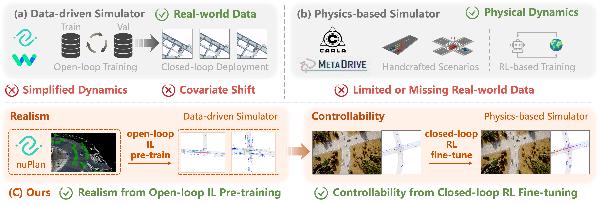
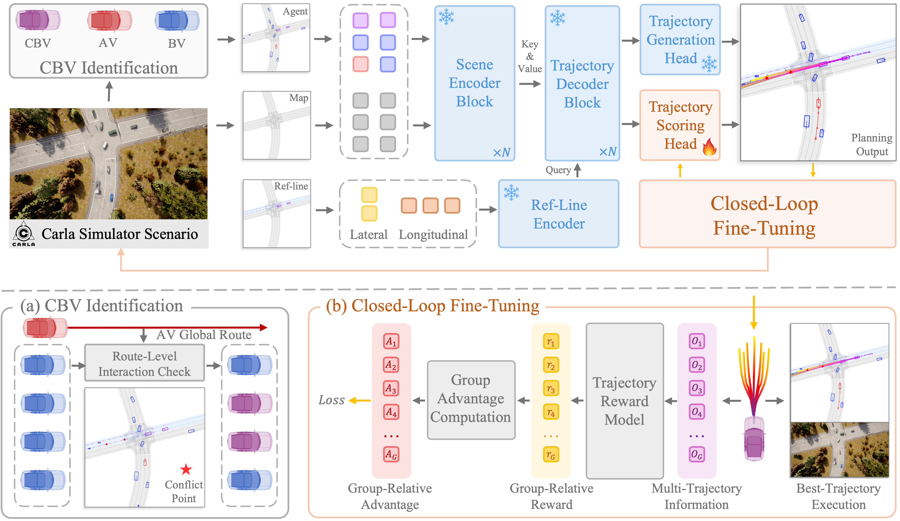

<div align="center">

</div>


# RIFT: Closed-Loop RL Fine-Tuning for Realistic and Controllable Traffic Simulation

<div align="left">
    <a href="https://arxiv.org/abs/2505.03344"></a>     
    <a href="https://currychen77.github.io/RIFT/"></a>
</div>

<table style="border-collapse: collapse; width: 100%; table-layout: fixed;">
  <tr>
    <td style="border: 0; padding: 0; width: 50%;">
      
    </td>
    <td style="border: 0; padding: 0; width: 50%;">
      
    </td>
  </tr>
</table>

##  :sparkles: News

- **`2025-05-07`** Explore our project page, now live [here](https://currychen77.github.io/RIFT)🔗!
- **`2025-05-07`** Our paper is available on [arXiv](https://arxiv.org/abs/2505.03344)📄!

This repository contains the implementation of the paper.

> RIFT: Closed-Loop RL Fine-Tuning for Realistic and Controllable Traffic Simulation<br>
>
> [Keyu Chen](https://currychen77.github.io/)<sup>1</sup> , [Wenchao Sun](https://scholar.google.com/citations?user=yd-sMoQAAAAJ&hl=zh-CN&oi=ao)<sup>1</sup>,  [Hao Cheng](https://github.com/AutoChengh)<sup>1</sup>, [Sifa Zheng](http://www.svm.tsinghua.edu.cn/essay/80/1835.html)<sup>1</sup><br>
>
> <sup>1</sup>School of Vehicle and Mobility, Tsinghua University<br>

If you find our work useful, Please give us a star 🌟!

<div style="text-align: center;">    </div>

:dizzy: *RIFT achieve realistic and controllable traffic simulation by combining open-loop IL pre-training in a data-driven simulator for realism with closed-loop RL fine-tuning in a physics-based simulator for controllability.*

## Method

<div style="text-align: center;">    </div>

### TODO List

- [ ] full model checkpoint
- [x] training code
- [x] initial repo & paper


## Outline

  - [Setup](#Setup)
  - [Data and Ckpt](#Data-and-Ckpt)
  - [Usage](#Usage)
    - [Fine Tune CBV Policy](#Fine-Tune-CBV-Policy)
    - [Evaluation](#Evaluation)
    - [Visualization](#Visualization)

* [Citation](#Citation)

* [Acknowledgement](#Acknowledgement)

## Setup

**Recommended system: Ubuntu 20.04 or 22.04**

**Step 1: Install Carla**

```bash
mkdir carla
cd carla
wget https://carla-releases.s3.us-east-005.backblazeb2.com/Linux/CARLA_0.9.15.tar.gz
tar -xvf CARLA_0.9.15.tar.gz
cd Import && wget https://carla-releases.s3.us-east-005.backblazeb2.com/Linux/AdditionalMaps_0.9.15.tar.gz
cd .. && bash ImportAssets.sh
export CARLA_ROOT=YOUR_CARLA_PATH
echo "$CARLA_ROOT/PythonAPI/carla/dist/carla-0.9.15-py3.7-linux-x86_64.egg" >> YOUR_CONDA_PATH/envs/YOUR_CONDA_ENV_NAME/lib/python3.7/site-packages/carla.pth # python 3.8 also works well, please set YOUR_CONDA_PATH and YOUR_CONDA_ENV_NAME
```

**Step 2: Setup conda environment**

```bash
conda create -n rift python=3.8
conda activate rift
```

**Step 3: Clone this git repo in an appropriate folder**

```bash
git clone git@github.com:CurryChen77/RIFT.git
cd RIFT
```

**Step 4: Install packages**

```bash
pip install -r requirements.txt
pip install -e .
```

## Data and Ckpt

* **Carla Map Data**

[Doc of HD Map](docs/map_api.md)

|       Name        |                         Google Drive                         | Approx. Size |         Storage Place         |
| :---------------: | :----------------------------------------------------------: | :----------: | :---------------------------: |
|    HD Map Data    | [Link](https://drive.google.com/drive/folders/1CWdcO2Gd-Qd9cF-bBTC1oK6jVZtFGDj3?usp=drive_link) |    714 MB    |   [Folder](./data/map_data)   |
| Speed Limits Data | [Link](https://drive.google.com/drive/folders/142JqYn4h8KDgHGxR1JOogHGRbynyLlBg?usp=drive_link) |    79 MB     | [Folder](./data/speed_limits) |

* **AV Checkpoint**

|   AV Name    |                         Google Drive                         | Approx. Size |                Storage Place                 |
| :----------: | :----------------------------------------------------------: | :----------: | :------------------------------------------: |
| PlanT_medium | [Link](https://drive.google.com/drive/folders/1RdOYMJIbSEb07_32v89brobYiqt9c81d?usp=drive_link) |    695 MB    | [Folder](./rift/ego/model_ckpt/PlanT_medium) |

* **CBV Checkpoint**

|        CBV Name        |                         Google Drive                         | Approx. Size |                 Storage Place                  |
| :--------------------: | :----------------------------------------------------------: | :----------: | :--------------------------------------------: |
|         Pluto          | [Link](https://drive.google.com/drive/folders/18bXqs8nT1gr3-xnTUlxGN2jxnQV5BqFQ?usp=drive_link) |   51.4 MB    | [Folder](./rift/cbv/planning/model_ckpt/pluto) |
| Other Fine-tuned model |                         Coming Soon                          |      -       |    [Folder](./rift/cbv/planning/model_ckpt)    |

## Usage

### Fine Tune CBV Policy

#### Run with Python

Parallel execution of Python scripts is allowed as long as each script is assigned a different **CUDA_VISIBLE_DEVICES**.

``````bash
# Train rift pluto
CUDA_VISIBLE_DEVICES=0 python scripts/run.py --ego_cfg pdm_lite.yaml --cbv_cfg rift_pluto.yaml --mode train_cbv
``````

#### Run with Bash (with Resume)

Multiple Runs for Resume (Carla will **crash** for some reasons in Fine-tuning)

```bash
bash scripts/run_multi.sh \
  -t 3 \                         # max try
  -e pdm_lite.yaml \             # ego file
  -c rift_pluto.yaml \           # cbv file
  -m train_cbv \                 # run mode (train_cbv, train_ego, eval, collect_data)
  -r 2 \                         # scenario repeat time
  -s 0 \                         # random seed
  -g 0 \                         # GPU_ID
  -v                             # render or not
```

### Evaluation

#### Evaluating for specific CBV and AV

```bash
# Eval rift pluto
CUDA_VISIBLE_DEVICES=0 python scripts/run.py --ego_cfg pdm_lite.yaml --cbv_cfg rift_pluto.yaml --mode eval -rep 1
```

#### Plot Evaluation Result

* Plot Speed and Acceleration Distribution

```bash
python tools/plot/plot_distribution.py
```

* Plot Evaluation Results

```bash
python tools/plot/plot_eval_results.py
```

### Visualization

```bash
# Eval rift pluto
CUDA_VISIBLE_DEVICES=0 python scripts/run.py --ego_cfg pdm_lite.yaml --cbv_cfg rift_pluto.yaml --mode eval --render -rep 1  # add --render
```

## Citation

If you find our paper useful, please kindly cite us via:

```BibTex
@article{chen2025riftclosedlooprlfinetuning,
    title={RIFT: Closed-Loop RL Fine-Tuning for Realistic and Controllable Traffic Simulation},
    author={Keyu Chen and Wenchao Sun and Hao Cheng and Sifa Zheng},
    journal={arXiv preprint arXiv:2505.03344},
    year={2025}
}
```

## Acknowledgement

This implementation is based on code from several repositories. We sincerely thank the authors for their awesome work.
- [Pluto](https://github.com/jchengai/pluto)
- [FREA](https://github.com/CurryChen77/FREA/tree/main)
- [Bench2Drive](https://github.com/Thinklab-SJTU/Bench2Drive)
- [DriveLM-CARLA](https://github.com/OpenDriveLab/DriveLM/tree/DriveLM-CARLA/pdm_lite)
- [PlanT](https://github.com/autonomousvision/plant/tree/1bfb695910d816e70f53521aa263648072edea8e)
- [nuPlan](https://github.com/motional/nuplan-devkit)
